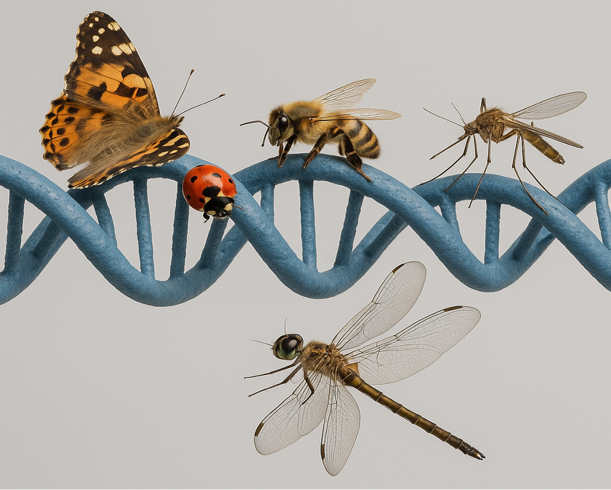

# barcodemetrics
<div align="center">
<figure>

</figure>
</div>


## Overview
This repository contains code for analyzing DNA nucleotide barcode sequences. 
The DNA nucleotide sequences are organized by taxonomic ranks—phylum, class, order, family, subfamily, genus, and species. 
Every taxonomic rank consists of subgroups, and each subgroup 
includes identical DNA barcode sequences. This defines the data structure derived from the [BIOSCAN-1M](https://github.com/bioscan-ml/BIOSCAN-1M)
and [BIOSCAN-5M](https://github.com/bioscan-ml/BIOSCAN-5M) biological datasets, used for statistical analysis of DNA nucleotide barcode sequences.

If you make use of *barcodemetrics* code repository, please cite the following [paper](https://arxiv.org/abs/2406.12723):

```bibtex
@inproceedings{gharaee2024bioscan5m,
    title={{BIOSCAN-5M}: A Multimodal Dataset for Insect Biodiversity},
    booktitle={Advances in Neural Information Processing Systems},
    author={Zahra Gharaee and Scott C. Lowe and ZeMing Gong and Pablo Millan Arias
        and Nicholas Pellegrino and Austin T. Wang and Joakim Bruslund Haurum
        and Iuliia Zarubiieva and Lila Kari and Dirk Steinke and Graham W. Taylor
        and Paul Fieguth and Angel X. Chang
    },
    editor={A. Globerson and L. Mackey and D. Belgrave and A. Fan and U. Paquet and J. Tomczak and C. Zhang},
    pages={36285--36313},
    publisher={Curran Associates, Inc.},
    year={2024},
    volume={37},
    url={https://proceedings.neurips.cc/paper_files/paper/2024/file/3fdbb472813041c9ecef04c20c2b1e5a-Paper-Datasets_and_Benchmarks_Track.pdf},
}
```
## Getting Started 
To set up the environment required for the Barcode Metrics project, use the provided barcode_env.yaml file:

#### Step 1: Create the Conda Environment
```bash
conda env create -f barcode_env.yaml
````

#### Step 2: Activate the Environment
```bash
conda activate barcode_env
````

## DNA Barcode Sequence
The DNA barcode sequence highlights the arrangement of the four nucleotides—Adenine (A), Thymine (T), Cytosine (C), 
and Guanine (G)—within a specific gene region, such as the mitochondrial cytochrome c oxidase subunit I (COI) gene. 

```
TTTATATTTTATTTTTGGAGCATGATCAGGAATAGTTGGAACTTCAATAAGTTTATTAATTCGAACAGAATTAAGCCAACCAGGATCAACATTTAT ....
```

## Shannon Diversity Index (SDI)
The Shannon Diversity Index (SDI) quantifies genetic diversity by considering both:

- **Richness:** Number of unique DNA barcodes
- **Evenness:** Distribution of samples across those barcodes

A high SDI indicates a diverse subgroup with evenly distributed barcodes, while a low SDI reflects dominance by a few barcodes (i.e., low evenness and redundancy).

For a subgroup *T* with *N* unique barcodes:

<div align="center">
SDI<sub>T</sub> = -∑<sub>i=1</sub><sup>N</sup> p<sub>i</sub> log<sub>2</sub>(p<sub>i</sub>)
</div>

Where:
- p<sub>i</sub> is the proportion of samples with the *i*-th barcode.
- The sum runs over all *N* unique barcodes in subgroup *T*.

The following table presents the DNA barcode statistics for various taxonomic ranks in the BIOSCAN-5M dataset. The table includes:

- **Total Count** number of unique barcodes for the samples labeled at each rank.
- **Mean**, **Median**, and **Standard Deviation** of the number of unique barcodes within the subgroupings at that rank.
- **Average Shannon Diversity Index (SDI)** for the DNA barcodes (measured in bits).
- **Mean** and **Standard Deviation** of pairwise DNA barcode sequence distances, aggregated across subgroups for each taxonomic rank.

> **U.B.** — Unique DNA Barcode Sequence  
> **P.D.** — Pairwise Damerau-Levenshtein Distance
> 
| **Level**   | **Categories** | **Total Count** U.B. | **Mean** U.B. | **Median** U.B. | **Std. Dev.** U.B. | **Avg SDI** U.B. | **Mean** P.D. | **Std. Dev.** P.D. |
|-------------|----------------|----------------------|---------------|-----------------|--------------------|------------------|---------------|--------------------|
| `phylum`    | 1              | 2,486,492            |               |                 |                    | 19.78            | 158           | 42                 |
| `class`     | 10             | 2,482,891            | 248,289       | 177             | 725,237            | 8.56             | 166           | 103                |
| `order`     | 55             | 2,474,855            | 44,997        | 57              | 225,098            | 7.05             | 128           | 53                 |
| `family`    | 934            | 2,321,301            | 2,485         | 46              | 19,701             | 5.42             | 90            | 46                 |
| `subfamily` | 1,542          | 657,639              | 426           | 17              | 3,726              | 4.28             | 78            | 51                 |
| `genus`     | 7,605          | 531,109              | 70            | 5               | 1,061              | 2.63             | 50            | 39                 |
| `species`   | 22,622         | 202,260              | 9             | 2               | 37                 | 1.46             | 17            | 18                 |
| `BIN`       | 324,411        | 2,474,881            | 8             | 2               | 40                 | 1.29             | N/A           | N/A                |


## Damerau-Levenshtein Distance for DNA Barcodes
The Damerau-Levenshtein distance extends the standard Levenshtein metric by including adjacent character transpositions 
in addition to insertions, deletions, and substitutions. It quantifies the similarity between DNA sequences based on 
the minimum number of such edits required to transform one sequence into another.

The code computes the average pairwise Damerau-Levenshtein distances between unique DNA barcodes at various taxonomic ranks. For each subgroup:

- Groups with <4 unique sequences are excluded.
- For groups with >1,000 sequences, 1,000 are randomly sampled.
- Sequences are first aligned using MAFFT.
- Pairwise distances are computed using the Damerau-Levenshtein metric.
- Mean and standard deviation are aggregated across subgroups of a taxonomic rank.

## 🔧 Pairwise Distance Calculation: Pandas & Spark Implementations
The repository supports two implementations of DNA barcodes pairwise distance calculations one with Pandas and the other with Apache Spark (PySpark).
For optimal performnace conduct experiments in two separate phases:

> **ℹ️ Note** Use the Pandas implementation for small datasets. For large datasets such as BIOSCAN-5M, the Apache Spark implementation is recommended.

### I. Calculate & Save SDI and Pairwise Distances
To calculate DNA barcode pairwise distances and save them in Parquet files or Pandas dataframes, run the following command:
```bash
python main.py --method <spark/padas> --compute_pwd --load_metadata --metadata_file <file-path> --ranked_data_file <file-path> --save_path <directory-path>
``` 

### II.  Enable Statistical Processing of SDI and Pairwise Distances
To extract statistics from the saved SDI and pairwise distances, execute the following:

```bash
python main.py --method <spark/pandas> --compute_full_statistics --display_table --save_statistics --ranked_data_file <file-path> --save_path <directory-path>
``` 

### III.  Visual Representation of Pairwise Distance Statistics
The visualization summarizes the distribution of SDI and pairwise distances across taxonomic ranks. 
Each boxplot displays the Interquartile Range (IQR)—the range between the 25th percentile (Q1) and 
the 75th percentile (Q3)—capturing the central 50% of the data. The median (Q2) is shown as a line inside the box. 
Whiskers extend up to 1.5 times the IQR from Q1 and Q3, indicating data spread and helping to identify potential outliers.

To visualize the statics execute the following:

```bash
python visualization.py --create_plots --rank <Taxonomic-rank> --metadata_file <file-path> --ranked_data_file <file-path> --distances_path <directory-path> --save_path <directory-path>
``` 

-----
#### Distributions of SDI across taxonomic ranks
<div align="center">
  <figure>
    
    <figcaption><b>Figure 1: </b>Distribution of Shannon Diversity Index (SDI) across subgroups of taxonomic ranks. The x-axis represents the taxonomic ranks. The results indicate that DNA barcode diversity decreases as you move from higher (less specific) to lower (more specific) taxonomic ranks.
    </figcaption>
  </figure>
</div>

-----
#### Distributions of pairwise distance across subgroups of class

<div align="center">
  <figure>
    
    <figcaption><b>Figure 2: </b>Distribution of pairwise distances of subgroups of class. The x-axis shows the subgroup
    categories sorted alphabetically.</figcaption>
  </figure>
</div>

-----
#### Distributions of pairwise distance across subgroups of order

<div align="center">
  <figure>
    
    <figcaption><b>Figure 3: </b>Distribution of pairwise distances of subgroups of order. The x-axis shows the subgroup
    categories sorted alphabetically.</figcaption>
  </figure>
</div>

-----
#### Distributions of pairwise distance across subgroups of species

<div align="center">
  <figure>
    
  </figure>
</div>
<div align="left">
  <p><b>Figure 4:</b> Distribution of pairwise distances of subgroups of species. Among the species, there are
    8,372 distinct subgroups with sufficient identical barcodes for calculating pairwise distances, which
    makes visualization challenging. To address this, the groups are sorted in descending order based
    on their mean distances and partitioned into 100 bins. These bins are used to plot the distribution
    of pairwise distances within the species rank. The mean distance of each bin is displayed along the
    x-axis.</div>


